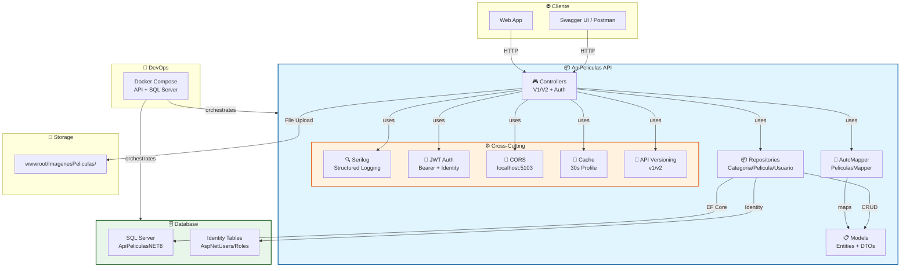
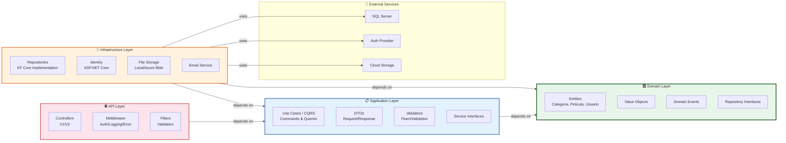
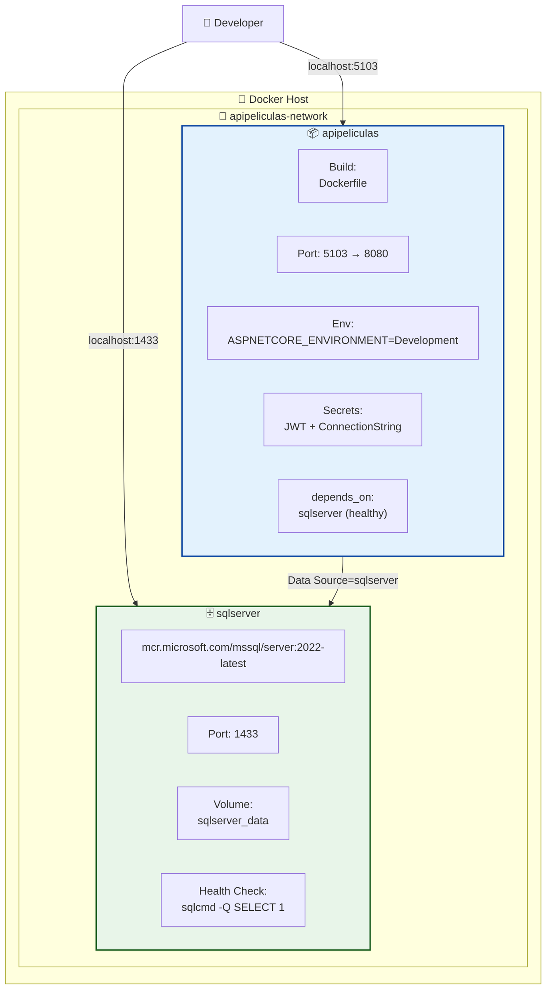
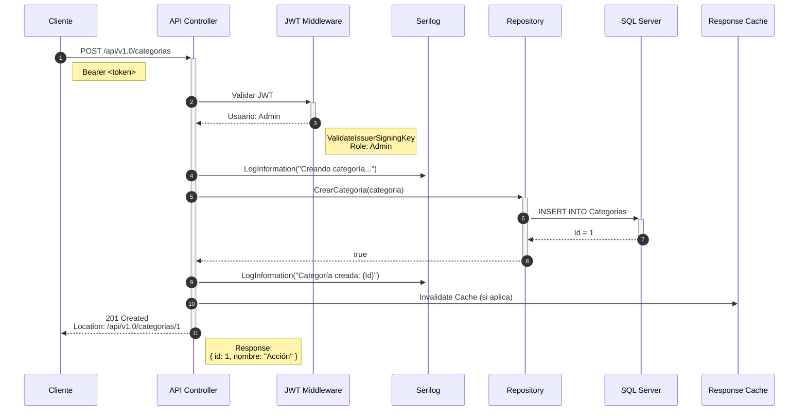
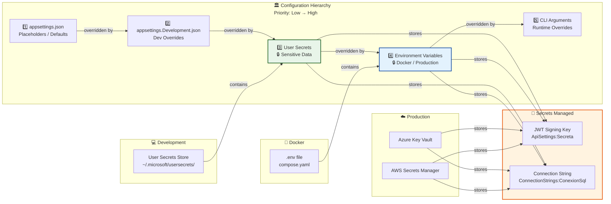

# ApiPeliculas - Architecture Diagrams

## Diagrama 1: Arquitectura Actual (Monolito N-Layer)



---

## Diagrama 2: Arquitectura Target (Clean Architecture)



---

## Diagrama 3: Docker Compose (Desarrollo)



---

## Diagrama 4: Flow de una Request (Autenticada)



---

## Diagrama 5: Security & Secrets Hierarchy



---

## Diagrama 6: CI/CD Pipeline (Target)

```mermaid
graph LR
    subgraph Dev["👨‍💻 Developer"]
        Code["Code + Tests"]
        PR["Pull Request"]
    end

    subgraph CI["🔄 CI Pipeline"]
        Build["dotnet build"]
        Test["dotnet test<br/>13 tests"]
        Lint["dotnet format"]
        Security["Security Scan"]
    end

    subgraph CD["🚀 CD Pipeline"]
        DockerBuild["docker build"]
        Push["Push to Registry"]
        Deploy["Deploy to Cloud"]
    end

    subgraph Cloud["☁️ Cloud"]
        AzureContainer["Azure Container Apps"]
        AWSContainer["AWS ECS/Fargate"]
        Monitoring["Application Insights<br/>CloudWatch"]
    end

    Code --> PR
    PR --> Build
    Build --> Test
    Test --> Lint
    Lint --> Security
    Security --> DockerBuild
    DockerBuild --> Push
    Push --> Deploy
    Deploy --> AzureContainer
    Deploy --> AWSContainer
    AzureContainer --> Monitoring
    AWSContainer --> Monitoring

    style CI fill:#e8f5e9,stroke:#1b5e20,stroke-width:2px
    style CD fill:#e3f2fd,stroke:#0d47a1,stroke-width:2px
    style Cloud fill:#fce4ec,stroke:#c62828,stroke-width:2px
```



---

## Cómo usar estos diagramas

### En VS Code con "Diagrams Previewer"

1. **Instala la extensión**:
   - Busca `Markdown Preview Mermaid Support` en VS Code Marketplace
   - O `Markdown PDF` (incluye Mermaid)
   - O `Diagrams Previewer` (si soporta Mermaid)

2. **Abre este archivo** en VS Code:
   ```
   .opencode/docs/diagrams.md
   ```

3. **Abre la preview**:
   - `Ctrl+Shift+V` (Windows/Linux)
   - `Cmd+Shift+V` (Mac)
   - O clic derecho → "Open Preview"

4. **Los diagramas se renderizan automáticamente** como SVG

### En GitHub

GitHub soporta Mermaid nativamente en Markdown:
- Solo sube este archivo a un repo
- Los diagramas se renderizan automáticamente en la vista web

### Exportar como imagen

Para exportar como PNG/PDF:
```bash
# Usando Mermaid CLI
npm install -g @mermaid-js/mermaid-cli
mmdc -i diagrams.md -o output.pdf
```

---

## Notas

- **Mermaid** es el estándar de facto para diagramas en Markdown
- **Sintaxis**: Similar a PlantUML pero más simple
- **Tipos de diagramas**: Flowchart, Sequence, Gantt, Class, State, ER, User Journey
- **Customización**: Colores, estilos, themes via CSS

---

*Diagramas generados por: OpenCode (Agente Arquitecto)*
*Fecha: 2026-06-10*
*Formato: Mermaid (compatible con VS Code, GitHub, GitLab)*
